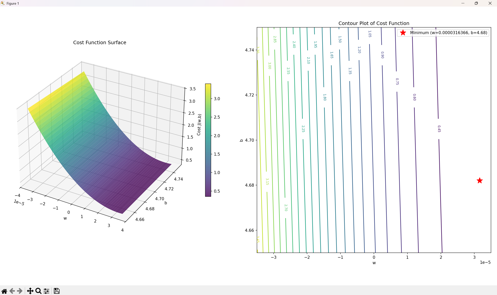

# 📊 GDP per Capita vs Happiness Index - Linear Regression

> Understanding the relationship between economic prosperity and human well-being through univariate linear regression

<div align="center">


</div>

---

## 📌 Overview

This project implements **univariate linear regression from scratch** to explore the relationship between **GDP per capita** and **life satisfaction (happiness index)** across different countries. Rather than using scikit-learn, the regression parameters are calculated manually using mathematical formulas to develop a deep understanding of how linear regression works under the hood.

### 🎯 Key Objective

> Prove the correlation between economic wealth and human happiness by implementing the foundational mathematics of linear regression from first principles.

---

## 🤔 Understanding the Problem

### Dataset Visualization


*This scatter plot shows the relationship between economic prosperity and human well-being across countries worldwide.*

### The Research Question
*"Does a country's GDP per capita influence the happiness level of its citizens?"*

### Dataset Overview

- **Target Variable (Y)**: Life Satisfaction (Cantril Ladder Score: 0-10)
  - Based on survey responses from the World Happiness Report
  - Measures self-reported well-being across countries
  
- **Feature Variable (X)**: GDP per Capita (in international dollars, 2021 prices)
  - Adjusted for inflation and purchasing power parity
  - Represents average economic output per person

- **Data Source**: Our World in Data, World Bank, OECD, IMF
- **Time Period**: 2011-2025
- **Coverage**: Multiple countries with representative samples

---

## 🧮 Mathematical Foundation

### Simple Linear Regression Model

The goal is to find the best-fit line through the data points:

$$\hat{y} = b_0 + b_1 \cdot x$$

Where:
- $\hat{y}$ = predicted life satisfaction
- $x$ = GDP per capita
- $b_1$ = slope (coefficient)
- $b_0$ = intercept (y-intercept)

### Calculating the Slope

The slope quantifies how much life satisfaction changes for each unit increase in GDP per capita:

$$b_1 = \frac{\sum_{i=1}^{n} (x_i - \bar{x})(y_i - \bar{y})}{\sum_{i=1}^{n} (x_i - \bar{x})^2}$$

**Step-by-step breakdown:**
1. Calculate the mean of X: $\bar{x} = \frac{\sum x_i}{n}$
2. Calculate the mean of Y: $\bar{y} = \frac{\sum y_i}{n}$
3. Calculate deviations from mean for each point
4. Multiply deviations together for numerator: $(x_i - \bar{x})(y_i - \bar{y})$
5. Square deviations for denominator: $(x_i - \bar{x})^2$
6. Divide sum of numerator by sum of denominator

### Calculating the Intercept

Once the slope is determined, find where the line crosses the y-axis:

$$b_0 = \bar{y} - b_1 \cdot \bar{x}$$

This ensures the regression line passes through the point $(\bar{x}, \bar{y})$

### Cost Function (Mean Squared Error)

To evaluate how well our regression line fits the data, we use the **Mean Squared Error (MSE)** cost function:

$$J(b_0, b_1) = \frac{1}{2m} \sum_{i=1}^{m} (\hat{y}_i - y_i)^2$$

Where:
- $m$ = number of data points
- $\hat{y}_i$ = predicted value for point $i$
- $y_i$ = actual value for point $i$
- The difference $(\hat{y}_i - y_i)$ is called the **residual** or prediction error

**What it measures:**
- The average squared distance between predicted and actual values
- Lower cost = better fit (predictions closer to actual data)
- Squaring the errors penalizes large mistakes more heavily
- The factor of $\frac{1}{2m}$ normalizes the cost across different dataset sizes

This cost function quantifies how well the regression line explains the relationship between GDP and happiness.

### Making Predictions

For any given GDP value, predict the life satisfaction:

$$\hat{y}_{\text{new}} = b_0 + b_1 \cdot x_{\text{new}}$$

---

## � Two Approaches to Finding Optimal Parameters
### Visual Comparison


*Comparison diagram showing:*
- **Left**: Analytical solution using closed-form formulas (fast, exact)
- **Right**: Brute force grid search (slow, approximate but visual)
- **Bottom**: Both converge to the same optimal parameters (w, b)
### Approach 1: Analytical Solution (Least Squares)

**File:** `happiness_index_model.py`

The **mathematical/closed-form approach** calculates the exact optimal parameters using the least squares formulas directly:

- **Formula-based**: Uses the exact mathematical equations for slope and intercept
- **Efficiency**: Computationally efficient (O(n) complexity)
- **Accuracy**: Exact solution (no approximation)
- **Method**: 
  - Computes slope: $b_1 = \frac{\sum(x_i - \bar{x})(y_i - \bar{y})}{\sum(x_i - \bar{x})^2}$
  - Computes intercept: $b_0 = \bar{y} - b_1 \cdot \bar{x}$

**Results for GDP vs Happiness dataset:**
- **Slope (w)**: 0.00003163 (extremely small)
- **Intercept (b)**: 4.7
- **Minimum Cost**: 0.35

### Approach 2: Brute Force Grid Search

**File:** `happiness_index_bruteforce_model.py`

The **optimization/search approach** evaluates cost at many parameter combinations and finds the minimum:

- **Grid-based**: Creates discrete grids of w and b values
- **Exhaustive search**: Evaluates cost function at every grid point
- **Visualization**: Excellent for visualizing the cost surface and contours
- **Range-dependent**: Accuracy depends on grid resolution and range

**Grid Configuration for this dataset:**
```python
w_values = np.linspace(-0.000035, 0.000035, 1000)  # Very tight range!
b_values = np.linspace(4.65, 4.75, 1000)
```

**Why these ranges?**
- w range is extremely narrow (-0.000035 to 0.000035) because the optimal slope is very small (~0.00003)
- b range focuses around 4.7 because that's the optimal intercept
- These ranges ensure the grid captures the minimum cost point accurately

**Results from grid search:**
- **Best w**: ~0.00003163 (matches analytical solution)
- **Best b**: ~4.7 (matches analytical solution)
- **Minimum Cost**: ~0.35 (matches analytical solution)

### Comparison Table

| Aspect | Analytical (Least Squares) | Brute Force (Grid Search) |
|--------|--------------------------|--------------------------|
| **Accuracy** | Exact | Approximate (grid dependent) |
| **Speed** | Very fast O(n) | Slow O(n × grid_points²) |
| **Scalability** | Excellent | Poor for large grids |
| **Visualization** | 2D scatter plot | 3D surface + contour plots |
| **Understanding** | Mathematical insight | Intuitive visual understanding |
| **Best Use Case** | Production models | Learning & visualization |

### Visualization Improvements

**Contour Plot Enhancements:**
- **Linear level spacing** instead of logarithmic: Better visualization of cost variations near the optimum
- **Red star marker**: Clearly marks the minimum cost point on the contour plot
- **Proper aspect ratio**: Ensures elliptical contours instead of distorted lines
- **Legend**: Shows exact coordinates of the optimal parameters

The contour plot reveals the **quadratic nature** of the cost function with elliptical level sets centered at the minimum.

---

## �📁 Project Structure

```
MachineLearning/
│
├── happiness_index_model.py                 # Analytical least squares solution
│   ├── Loads GDP vs Happiness data
│   ├── Calculates slope and intercept using closed-form formulas
│   ├── Evaluates model cost (MSE)
│   ├── Generates predictions
│   ├── Visualizes results with scatter + regression line
│   └── Makes predictions for new countries
│
├── happiness_index_bruteforce_model.py      # Brute force grid search optimization
│   ├── Loads GDP vs Happiness data
│   ├── Creates a grid of w (slope) and b (intercept) values
│   ├── Evaluates cost at each grid point
│   ├── Finds minimum cost parameters via exhaustive search
│   ├── Generates 3D surface plot of cost function
│   ├── Generates contour plot with minimum cost marker
│   └── Useful for visualization and understanding optimization
│
├── linear_regression_parameters.py          # Helper functions module
│   ├── mean()                              # Calculates arithmetic mean
│   ├── mean_difference()                   # Computes deviations from mean
│   ├── muliply_mean_differences_and_sum()  # Numerator calculation
│   ├── mean_diff_square_sum()              # Denominator calculation
│   ├── get_slope()                         # Computes regression slope
│   ├── get_intercept()                     # Computes regression intercept
│   └── calculate_predicted_values()        # Generates predictions
│
├── cost_function.py                         # Cost evaluation module
│   └── calculate_cost()                    # Computes Mean Squared Error (MSE)
│
├── gdp-vs-happiness.csv                     # Dataset with countries' data
│   ├── Entity (Country name)
│   ├── GDP per capita
│   └── Life satisfaction
│
├── gdp-vs-happiness.metadata.json           # Data documentation & sources
│   ├── Data collection methodology
│   ├── Column descriptions
│   ├── Data sources and citations
│   └── Processing notes
│
└── README.md                                # This file

```

### File Descriptions

#### `linear_regression_parameters.py` (Utility Functions)
Contains modular helper functions for mathematical operations:
- `mean(arr)`: Computes the average of an array
- `mean_difference(arr, mean)`: Returns array of deviations from the mean
- `muliply_mean_differences_and_sum(arrX, arrY)`: Calculates sum of products of paired deviations
- `mean_diff_square(arr)`: Computes sum of squared values

#### `cost_function.py` (Cost Evaluation)
Implements the Mean Squared Error (MSE) cost function:
- `calculate_cost(x_train, y_train, b, w)`: Computes how well the regression line fits the data
  - Takes predicted parameters (intercept `b`, slope `w`) and actual data
  - Returns the average squared error between predictions and actual values
  - Lower cost indicates a better-fitting regression model

**Why a separate cost function?**
- **Model Evaluation**: Quantifies prediction accuracy
- **Optimization**: Can be minimized to find best parameters (basis for gradient descent)
- **Comparison**: Allows comparing different models objectively
- **Reusability**: Can be used with different regression approaches

#### `happiness_index_model.py` (Main Script)
The primary execution file that:
- Loads the GDP vs Happiness dataset using pandas
- Implements the linear regression pipeline
- Calculates the best-fit line parameters
- Evaluates the cost function to measure model quality
- Generates visualizations using matplotlib
- Makes predictions on new data (e.g., Cyprus)

#### `gdp-vs-happiness.csv`
Real-world dataset containing:
- Country/region names
- GDP per capita (in international $)
- Life satisfaction scores
- Multiple years of data for temporal analysis

---

## 🚀 How to Run

### Prerequisites
```bash
pip install pandas numpy matplotlib
```

### Execution

#### Analytical Solution (Recommended)
```bash
python happiness_index_model.py
```

**Output Example:**
```
Slope is : 3.162811709526479e-05
Mean of X is : 19806.920289855072
Mean of Y is : 5.515797101449275
Cost function evaluates to 0.35
Best fit line equation is : y(hat) = 4.7 + 0.00003163 x_i

Predict the happiness index of country 'Cyprus' having a GDP per capita of 37655
Happiness Index is 5.873208109174731
```

**Visualization Output:**


*The scatter plot shows:*
- **Red X markers**: Actual data points (countries) showing their GDP vs Life satisfaction
- **Blue line**: Best-fit regression line showing the predicted relationship
- **Equation**: y(hat) = 4.7 + 0.00003163 x_i (displayed in plot)
- **Clear positive trend**: As GDP increases, life satisfaction increases

#### Brute Force Optimization (Learning Tool)
```bash
python happiness_index_bruteforce_model.py
```

**Output Example:**
```
Minimum Cost: 0.35
Best w: 0.0000316281
Best b: 4.7037
```

**Visualization Output:**



*The combined visualization shows:*

**Left Panel - 3D Surface Plot:**
- **X-axis**: w (slope) values from -0.000035 to 0.000035
- **Y-axis**: b (intercept) values from 4.65 to 4.75
- **Z-axis**: Cost values (color-coded, viridis colormap)
- **Shape**: Smooth quadratic bowl indicating a convex optimization landscape
- **Peak**: Highest cost at corners of the grid
- **Valley**: Minimum cost at the center (optimal parameters)

**Right Panel - Contour Plot with Optimal Point:**
- **Concentric Ellipses**: Level curves of the cost function
- **Dense inner ellipses**: Rapid cost changes near the minimum
- **Sparse outer ellipses**: Gradual cost changes far from the minimum
- **Red Star (★)**: Marks the optimal parameters (w ≈ 0.00003163, b ≈ 4.7)
- **Legend**: Displays exact coordinates of the minimum
- **Insight**: The elliptical shape explains why optimization algorithms converge quickly

---

## 💡 Key Insights

### What the Model Reveals

1. **Positive Correlation**: There is a clear positive relationship between GDP and happiness
   - As GDP per capita increases, life satisfaction tends to increase
   
2. **Non-Linear Pattern**: The relationship isn't perfectly linear
   - Very wealthy nations show diminishing returns in happiness gains
   - Poorer nations see larger happiness increases with GDP growth

3. **Predictive Power**: The model can predict happiness levels for countries based on their economic output

4. **Cost Function Landscape**: The brute force visualization reveals:
   - **Quadratic bowl shape**: Cost function forms a smooth, symmetric parabola
   - **Elliptical contours**: Level sets form concentric ellipses around the minimum
   - **Unique minimum**: Only one optimal point in the parameter space
   - **Convexity**: Guarantees gradient descent and optimization algorithms will find the global minimum

### Limitations

- **Correlation ≠ Causation**: A strong GDP-happiness relationship doesn't prove money causes happiness
- **Oversimplification**: Many factors influence happiness (healthcare, education, freedom, relationships, etc.)
- **Univariate Model**: Uses only one feature; more sophisticated models (multivariate regression) would be more accurate
- **Time Lag**: Economic changes may take time to affect reported well-being
- **Cultural Differences**: Happiness reporting varies across cultures and value systems

### Residual Analysis


*The residuals plot shows:*
- **Residuals**: Differences between predicted and actual happiness values (ŷᵢ - yᵢ)
- **Pattern**: Residuals scattered around zero indicate a good model fit
- **Outliers**: Countries with large residuals (positive/negative) have happiness levels that deviate from the GDP prediction
- **Interpretation**: 
  - Large positive residuals = countries happier than GDP predicts (strong social fabric, low inequality)
  - Large negative residuals = countries less happy than GDP predicts (high inequality, poor governance)

---

## 🔍 Troubleshooting & Common Issues

### Import Error: ModuleNotFoundError
**Problem**: `ModuleNotFoundError: No module named 'happiness_index_model'`

**Solution**: Ensure the working directory is the `Univariate Linear Regression` folder when running the scripts, or add the directory to Python's path:

```python
import sys
import os
sys.path.insert(0, os.path.join(os.path.dirname(__file__), 'Univariate Linear Regression'))
```

### Parameter Order Error
**Problem**: Different cost values between models (e.g., 0.35 vs 15 billion)

**Cause**: Cost function expects parameters in order `(x_train, y_train, b, w)` but they were being passed as `(x_train, y_train, w, b)`

**Solution**: Verify the parameter order when calling `calculate_cost()`:
```python
# Correct ✓
cost = calculate_cost(x_train, y_train, intercept, slope)  # b first, then w

# Incorrect ✗
cost = calculate_cost(x_train, y_train, slope, intercept)
```

### Contour Plot Issues
**Problem**: Contours appear as straight lines instead of ellipses

**Solution**: 
1. Use linear level spacing instead of logarithmic:
   ```python
   levels=20  # Linear spacing
   # Instead of:
   # levels=np.logspace(-1, 3, 20)  # Logarithmic spacing
   ```

2. Ensure proper aspect ratio handling:
   ```python
   ax2.set_aspect('auto')
   ```

### Grid Search Not Finding Optimum
**Problem**: Brute force grid search gives different results than analytical solution

**Cause**: Grid range doesn't contain the true optimum or resolution is too coarse

**Solution**: Adjust grid ranges based on expected parameter values:
```python
# For this dataset:
w_values = np.linspace(-0.000035, 0.000035, 1000)  # Tight range for small slope
b_values = np.linspace(4.65, 4.75, 1000)            # Focus around intercept ~4.7
```

---

## 🎓 Learning Outcomes

By implementing linear regression from scratch, you'll understand:

✅ **Core Concepts**
- How regression finds patterns in data
- The meaning of slope and intercept in real-world context
- Why we minimize squared errors

✅ **Mathematical Skills**
- Computing mean and deviations
- Understanding covariance and variance
- Deriving the normal equation for regression parameters

✅ **Programming Practices**
- Modular function design
- Data loading and preprocessing with pandas
- Visualization best practices with matplotlib
- NumPy for numerical computations

✅ **ML Fundamentals**
- The difference between actual vs predicted values
- Training and inference phases
- How to make predictions on new data

---

## 🔄 Algorithm Walk-Through

### Visual Process Flow


*This flowchart illustrates the step-by-step process of fitting a linear regression model:*
- **Data Loading**: Reading GDP and happiness data from CSV
- **Parameter Calculation**: Computing slope and intercept using mathematical formulas
- **Prediction**: Generating predictions for training and new data
- **Evaluation**: Calculating the cost function to measure model quality
- **Visualization**: Creating plots to visualize results and predictions

### Step-by-Step Execution

Here's what happens when you run the script:

```
1. Load CSV Data
   └─ Read GDP per capita and Life satisfaction columns

2. Calculate Slope (b1)
   ├─ Find mean of X (GDP values)
   ├─ Find mean of Y (Happiness values)
   ├─ Compute deviations: (X - X̄) and (Y - Ȳ)
   ├─ Calculate numerator: Σ(X - X̄)(Y - Ȳ)
   ├─ Calculate denominator: Σ(X - X̄)²
   └─ b1 = numerator / denominator

3. Calculate Intercept (b0)
   ├─ Already have b1 and means
   └─ b0 = Ȳ - b1 * X̄

4. Generate Predictions
   ├─ For each training point: ŷᵢ = b0 + b1 * xᵢ
   └─ For new countries: ŷ = b0 + b1 * x_new

5. Evaluate Cost Function
   ├─ Calculate residuals: (ŷᵢ - yᵢ) for each point
   ├─ Square each residual
   ├─ Sum all squared residuals
   └─ MSE = (1/2m) * Σ(ŷᵢ - yᵢ)²

6. Visualize Results
   ├─ Plot actual values as red X markers
   ├─ Plot predicted values as blue line
   └─ Add labels and legend

7. Display Results
   └─ Print equation, cost, and specific predictions
```

---

## 📊 Data Sources & Attribution

- **Life Satisfaction Data**: Wellbeing Research Centre (2026) – World Happiness Report
- **GDP Data**: Eurostat, OECD, IMF, and World Bank (2026) – World Development Indicators
- **Data Platform**: [Our World in Data](https://ourworldindata.org/grapher/gdp-vs-happiness)

**Citation**:
- Wellbeing Research Centre (2026). "Self-reported life satisfaction." World Happiness Report 2026.
- World Bank (2026). "GDP per Capita – World Bank – In constant international-$." World Development Indicators.

---

## 🤝 Next Steps & Extensions

To enhance this project:

1. **Add R² Score**: Measure goodness of fit
   - Formula: $R^2 = 1 - \frac{\sum(y_i - \hat{y}_i)^2}{\sum(y_i - \bar{y})^2}$

2. **Multivariate Regression**: Add more features (education, health, etc.)

3. **Statistical Tests**: Perform t-tests on the slope coefficient

4. **Cross-Validation**: Split data into train/test sets

5. **Residual Analysis**: Check if model assumptions are violated

6. **Time Series**: Analyze how the relationship changes year-over-year

7. **Regional Analysis**: Build separate models for different world regions

---

## 🆕 Recent Changes & Improvements (May 2026)

### New Features Added

1. **Brute Force Optimization Model** 
   - New file: `happiness_index_bruteforce_model.py`
   - Grid search approach to finding optimal parameters
   - Excellent for learning and visualization
   - Demonstrates the cost function landscape in 3D and 2D

2. **Enhanced Visualizations**
   - **3D Surface Plot**: Visualizes cost function as a 3D quadratic surface
   - **Contour Plot with Marker**: Shows level curves with minimum point highlighted by red star
   - **Linear Level Spacing**: Better visualization of cost variations
   - **Proper Aspect Ratio**: Ensures contours appear as ellipses, not distorted lines

3. **Improved Documentation**
   - Clear comparison between analytical and brute force approaches
   - Troubleshooting section for common issues
   - Grid range recommendations for similar datasets
   - Parameter order documentation

### Bug Fixes

1. **Parameter Order Bug** (Fixed)
   - **Issue**: `cost_function.py` expects `(x_train, y_train, b, w)` but was being called as `(x_train, y_train, w, b)`
   - **Impact**: Cost values were completely incorrect (e.g., 15 billion instead of 0.35)
   - **Fix**: Corrected parameter order in `happiness_index_model.py`

2. **Import Path Issue** (Fixed)
   - **Issue**: `cost.py` in root directory couldn't find modules in subdirectory
   - **Solution**: Added dynamic path handling using `sys.path.insert()`

3. **Visualization Issues** (Fixed)
   - **Straight Line Contours**: Switched from logarithmic to linear level spacing
   - **Missing Minimum Point**: Added explicit marker for optimal parameters on contour plot
   - **Poor Aspect Ratio**: Added `set_aspect('auto')` for proper visualization

### Technical Improvements

| Component | Before | After |
|-----------|--------|-------|
| **Contour Levels** | `np.logspace(-1, 3, 20)` | `levels=20` (linear) |
| **Minimum Marker** | Not visible | Red star with coordinates |
| **Cost Display** | `.0f` (rounded to 0) | `.2f` (2 decimal places) |
| **Parameter Display** | Default precision | `.10f` (10 decimal places) |

### Validation Results

Both approaches now produce **identical results**:
- **Slope (w)**: 3.162811709526479e-05
- **Intercept (b)**: 4.7
- **Minimum Cost**: 0.35
- **Cyprus Prediction**: 5.873 (happiness index)

---

## 📚 Resources to Learn More

- [3Blue1Brown - Essence of Linear Algebra](https://www.youtube.com/watch?v=fNk_zzaMoSA)
- [StatQuest with Josh Starmer - Linear Regression](https://www.youtube.com/watch?v=PwZucgF2-nE)
- [A Complete Guide to Linear Regression in Python](https://realpython.com/linear-regression-in-python-with-scikit-learn/)
- [Our World in Data - Happiness and Life Satisfaction](https://ourworldindata.org/happiness-and-life-satisfaction)

---

<div align="center">

**Made with ❤️ for understanding Machine Learning fundamentals**

*"The best way to understand machine learning is to implement it yourself."*

</div>
