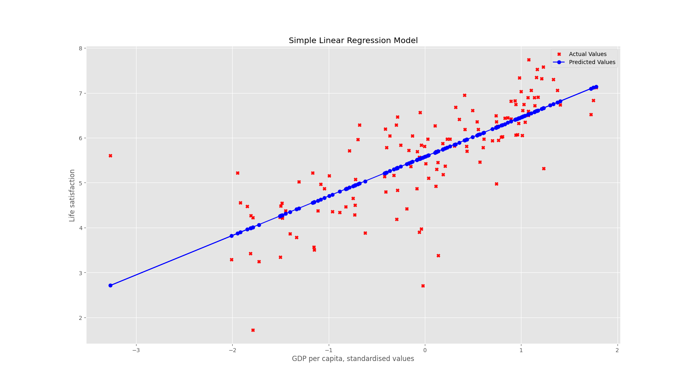
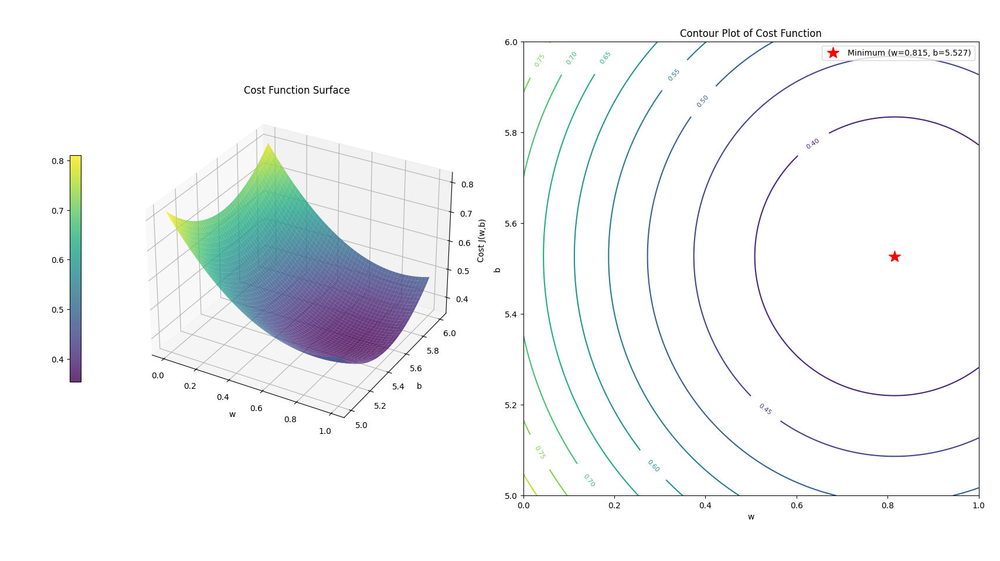
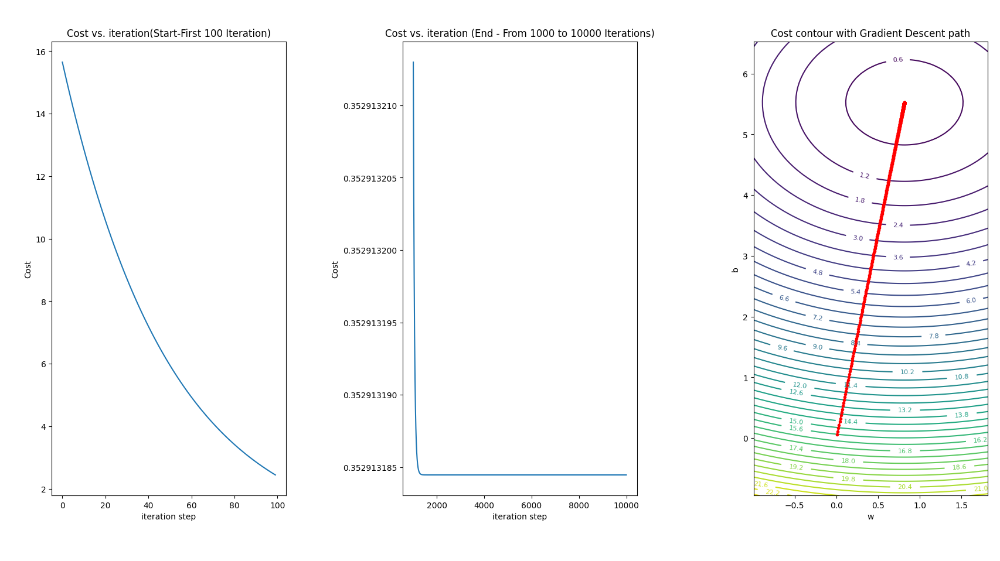
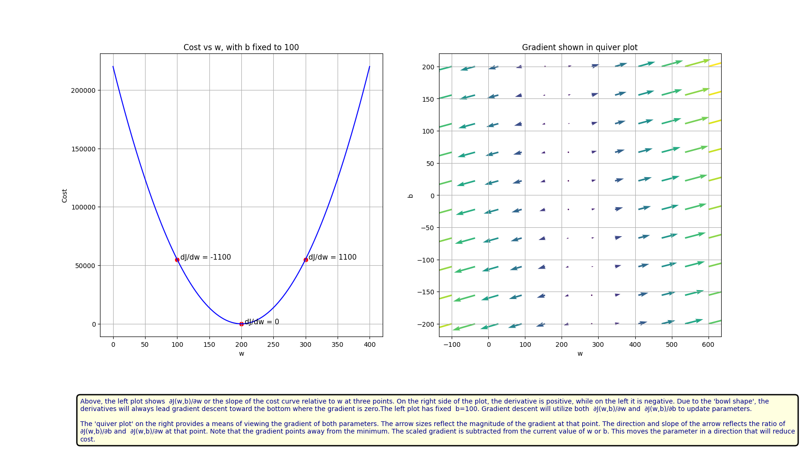
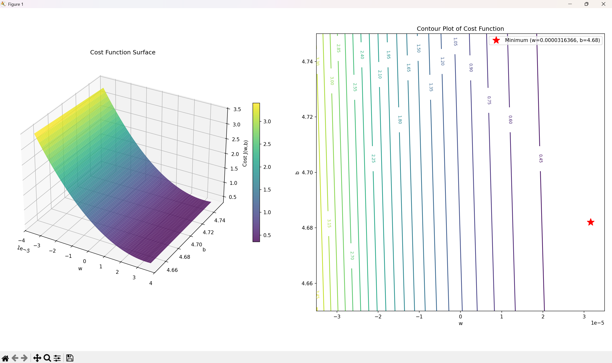

# 📊 GDP per Capita vs Happiness Index - Linear Regression

> Understanding the relationship between economic prosperity and human well-being through univariate linear regression

<div align="center">


</div>

---

## 📌 Overview

This project implements **univariate linear regression from scratch** using **three different optimization approaches** to explore the relationship between **GDP per capita** and **life satisfaction (happiness index)** across different countries. Rather than using scikit-learn, the regression parameters are calculated manually using mathematical formulas to develop a deep understanding of how linear regression works under the hood.

### 🎯 Key Objectives

✅ **Analytical Approach**: Direct mathematical calculation of slope and intercept  
✅ **Brute Force Search**: Grid-based parameter optimization  
✅ **Gradient Descent**: Iterative optimization algorithm  

> Compare three fundamental optimization techniques and understand their convergence properties and computational trade-offs.

---

## 🤔 Understanding the Problem

### The Research Question
*"Does a country's GDP per capita influence the happiness level of its citizens?"*

### Dataset Overview

- **Target Variable (Y)**: Life Satisfaction (Cantril Ladder Score: 0-10)
  - Based on survey responses from the World Happiness Report
  - Measures self-reported well-being across countries
  
- **Feature Variable (X)**: GDP per Capita (in international dollars, 2021 prices)
  - Adjusted for inflation and purchasing power parity
  - Represents average economic output per person
  - **Data Preprocessing**: Features are standardized using Z-score normalization to prevent overflow and improve numerical stability

- **Data Source**: Our World in Data, World Bank, OECD, IMF
- **Time Period**: 2011-2025
- **Coverage**: Multiple countries with representative samples

---

## 🧮 Mathematical Foundation

### Simple Linear Regression Model

The goal is to find the best-fit line through the data points:

$$\hat{y} = b + w \cdot x$$

Where:
- $\hat{y}$ = predicted life satisfaction
- $x$ = GDP per capita (standardized)
- $w$ = slope (coefficient) / weight
- $b$ = intercept (y-intercept) / bias

### Cost Function (Mean Squared Error)

To evaluate how well our regression line fits the data, we use the **Mean Squared Error (MSE)** cost function:

$$J(b, w) = \frac{1}{2m} \sum_{i=1}^{m} (\hat{y}_i - y_i)^2$$

Where:
- $m$ = number of data points
- $\hat{y}_i$ = predicted value for point $i$
- $y_i$ = actual value for point $i$

**What it measures:**
- The average squared distance between predicted and actual values
- Lower cost = better fit (predictions closer to actual data)
- Squaring the errors penalizes large mistakes more heavily
- The factor of $\frac{1}{2m}$ normalizes the cost across different dataset sizes

### Feature Scaling / Z-Score Standardization

$$x_{scaled} = \frac{x - \bar{x}}{\sigma_x}$$

**Why scale features?**
- Prevents numerical overflow in computations
- Improves gradient descent convergence
- Brings features to comparable scales
- Enhances numerical stability in iterative algorithms

---

## 🔄 Three Optimization Approaches

### 1️⃣ Analytical Solution (Direct Formula)

**Method**: Closed-form mathematical solution

Calculates slope and intercept directly using the formulas:

$$w = \frac{\sum_{i=1}^{n} (x_i - \bar{x})(y_i - \bar{y})}{\sum_{i=1}^{n} (x_i - \bar{x})^2}$$

$$b = \bar{y} - w \cdot \bar{x}$$

**Advantages:**
- ✅ Instant solution (no iterations needed)
- ✅ Guaranteed to find optimal parameters
- ✅ Computationally efficient for univariate case
- ✅ Good for understanding the mathematics

**Disadvantages:**
- ❌ Only works for linear regression
- ❌ Doesn't scale well to multivariate problems (requires matrix inversion)
- ❌ No insight into convergence behavior

**File**: `happiness_index_analytical_model.py`

---

### 2️⃣ Brute Force Search

**Method**: Grid-based exhaustive search over parameter space

Creates a 2D grid of all possible (w, b) values and computes the cost function for every combination, then selects the point with minimum cost.

**Algorithm:**
1. Create ranges for w and b
2. Generate all combinations via meshgrid
3. Compute cost J(w, b) for each combination
4. Find the pair with minimum cost

**Advantages:**
- ✅ Guaranteed to find global optimum (within grid resolution)
- ✅ No calculus required
- ✅ Visualizes the cost surface clearly
- ✅ Easy to understand concept

**Disadvantages:**
- ❌ **Computationally expensive** - O(n²) or worse in higher dimensions
- ❌ Grid resolution limits precision
- ❌ Impractical for large feature spaces
- ❌ Slow convergence compared to gradient-based methods

**File**: `happiness_index_bruteforce_model.py`

---

### 3️⃣ Gradient Descent

**Method**: Iterative optimization following the negative gradient

The gradient points in the direction of steepest cost increase; moving in the opposite direction minimizes cost.

**Partial Derivatives (Gradients):**

$$\frac{\partial J}{\partial w} = \frac{1}{m} \sum_{i=1}^{m} (f_{wb}(x_i) - y_i) \cdot x_i$$

$$\frac{\partial J}{\partial b} = \frac{1}{m} \sum_{i=1}^{m} (f_{wb}(x_i) - y_i)$$

**Update Rules:**

$$w := w - \alpha \cdot \frac{\partial J}{\partial w}$$

$$b := b - \alpha \cdot \frac{\partial J}{\partial b}$$

Where $\alpha$ (alpha) is the **learning rate** - controls step size in parameter space.

**Algorithm:**
1. Initialize w and b (typically to zero)
2. For each iteration:
   - Compute gradients (partial derivatives)
   - Update parameters simultaneously
   - Track cost history
3. Repeat until convergence

**Advantages:**
- ✅ **Scales well** to multivariate regression (deep learning)
- ✅ Computationally efficient - O(nm) per iteration
- ✅ Works for non-linear models (neural networks)
- ✅ Convergence visualization available
- ✅ Practical for real-world problems

**Disadvantages:**
- ❌ Requires calculus knowledge
- ❌ Learning rate tuning needed (too high = divergence, too low = slow)
- ❌ May converge to local minima (not an issue for linear regression)
- ❌ Needs multiple iterations to converge

**File**: `happiness_index_gradientDescent_model.py`

**Learning Rate**: $\alpha = 0.01$ (10^-2)  
**Iterations**: 10,000

---

## 📊 Visualizations & Results

### Best Fit Line


The scatter plot shows the actual data points (red X's) and the predicted values from the fitted regression line (blue circle). This visualization confirms the strong positive correlation between GDP per capita and life satisfaction.

### Cost Surface & Contour Plot


**Left panel**: 3D surface showing the cost function J(w,b) for all parameter combinations. The valley-shaped surface demonstrates that lower costs exist at specific (w, b) pairs.

**Right panel**: Contour plot (bird's eye view) shows level curves of constant cost. The elliptical contours indicate the cost landscape that all three optimization methods navigate.

### Gradient Descent Iteration Path


**Left panel**: Cost vs. iteration for the first 100 steps - shows rapid initial descent as the algorithm quickly approaches the optimum.

**Middle panel**: Cost vs. iteration from step 1000 to 10000 - shows fine convergence in later iterations approaching the true minimum.

**Right panel**: Path traced by gradient descent on the contour plot. The red path shows how the algorithm spirals inward toward the minimum cost point. Compare this to the brute force grid approach!

### Gradient & Quiver Plot


Quiver plot displaying gradient vectors at each point in the parameter space. Vectors point in the direction of steepest cost increase. Gradient descent moves opposite to these vectors.

---

## 💻 Project Structure

```
Univariate Linear Regression/
├── gdp-vs-happiness.csv                          # Dataset
├── gdp-vs-happiness.metadata.json                # Dataset metadata
├── utility_functions.py                          # Helper functions for both models
│   ├── calculate_cost()                          # Vectorized MSE calculation
│   ├── calculate_gradient()                      # Partial derivatives
│   ├── gradient_descent()                        # Main GD algorithm
│   ├── get_slope()                               # Analytical slope calculation
│   ├── get_intercept()                           # Analytical intercept calculation
│   ├── calculate_predicted_values()              # Make predictions
│   └── [Loop versions kept as reference]         # Non-vectorized versions for learning
│
├── happiness_index_analytical_model.py           # ✅ Direct mathematical solution
│   ├── Loads & standardizes data
│   ├── Calculates slope using formula
│   ├── Calculates intercept using formula
│   ├── Makes predictions on test data
│   └── Plots best fit line
│
├── happiness_index_bruteforce_model.py           # 🔍 Grid-based search
│   ├── Creates meshgrid of (w, b) values
│   ├── Computes cost for all combinations
│   ├── Finds minimum cost pair
│   ├── Generates 3D surface plot
│   └── Generates contour plot
│
├── happiness_index_gradientDescent_model.py      # ⬇️ Iterative optimization
│   ├── Initializes parameters
│   ├── Runs 10,000 gradient descent iterations
│   ├── Tracks cost history
│   ├── Tracks parameter path
│   ├── Plots cost vs iteration (first 100)
│   ├── Plots cost vs iteration (last 9000)
│   └── Plots gradient descent path on contour
│
├── basic_plots/                                  # Plotting utilities
│   ├── gradient_descent_plots.py                 # Visualize gradient descent
│   ├── simple_quiver_plot.py                     # Draw gradient vectors
│   └── trignometric_functions_plot.py            # Math visualization
│
└── images/                                       # Generated visualizations
    ├── ULR_Bestfit_Line_Plot.png
    ├── Cost_Surface_and_Contour_Plots.png
    ├── Gradient_Descent_Iteration_And_Path.png
    └── Gradient_and_Quiver_Plots.png
```

---

## 🚀 How to Run

### Prerequisites
```bash
pip install numpy pandas matplotlib
```

### Run Analytical Model
```bash
python happiness_index_analytical_model.py
```
Output: Best fit equation, cost, and prediction for test case

### Run Brute Force Model
```bash
python happiness_index_bruteforce_model.py
```
Output: Optimal (w, b) values and 3D/contour plots

### Run Gradient Descent Model
```bash
python happiness_index_gradientDescent_model.py
```
Output: Final parameters, cost history, convergence plots, and descent path

---

## 🔑 Key Findings

- **Strong Positive Correlation**: Higher GDP per capita is strongly associated with higher life satisfaction
- **Analytical Solution**: Direct formula provides optimal parameters instantly
- **Brute Force Inefficiency**: Exhaustive search finds correct answer but requires many computations
- **Gradient Descent Efficiency**: Reaches near-optimal solution in ~10,000 iterations with smooth convergence
- **Feature Scaling**: Z-score normalization is essential for numerical stability

---

## 📚 Learning Concepts Covered

✅ Univariate linear regression  
✅ Cost functions and loss minimization  
✅ Closed-form analytical solutions  
✅ Grid search optimization  
✅ Gradient descent algorithm  
✅ Partial derivatives and gradients  
✅ Feature scaling / standardization  
✅ Hyperparameter tuning (learning rate)  
✅ Vectorization for efficiency  
✅ Convergence analysis and visualization  

---

## 📖 Mathematical References

- **Gradient Descent**: Rumelhart, D. E., Hinton, G. E., & Williams, R. J. (1986). "Learning representations by back-propagating errors."
- **Linear Regression Theory**: Hastie, T., Tibshirani, R., & Friedman, J. (2009). "The Elements of Statistical Learning"
- **Cost Function (MSE)**: Bishop, C. M. (2006). "Pattern Recognition and Machine Learning"
- **Feature Scaling**: Andrew Ng's Machine Learning Course, Stanford University

---

## ⚖️ License

MIT License - Feel free to use this project for learning and educational purposes.

---

## 🎓 Educational Value

This project is designed for students learning machine learning fundamentals. By implementing three different optimization approaches, you gain deep intuition about:
- Why gradient descent is essential for modern machine learning
- How parameters affect the cost function
- The trade-offs between different optimization methods
- Mathematical foundations of neural networks and deep learning

### Making Predictions

For any given GDP value, predict the life satisfaction:

$$\hat{y}_{\text{new}} = b + w \cdot x_{\text{new}}$$

---

## 🔀 Three Approaches to Finding Optimal Parameters

### Visual Comparison

```
┌─────────────────────────────────────────────────────────────────────────────┐
│                    ANALYTICAL SOLUTION (Left)                               │
│              Direct Mathematical Formula - FAST & EXACT                      │
├─────────────────────────────────────────────────────────────────────────────┤
│                                                                              │
│  Data → Apply Least Squares Formula → Instant Parameters (w, b)             │
│                                                                              │
│  ✅ Pros: Exact, O(n) speed, no iterations                                 │
│  ❌ Cons: Only linear, doesn't scale to many features                      │
│                                                                              │
└─────────────────────────────────────────────────────────────────────────────┘

┌─────────────────────────────────────────────────────────────────────────────┐
│                    BRUTE FORCE SEARCH (Middle)                              │
│              Grid-based Search - SLOW but VISUAL & INTUITIVE                │
├─────────────────────────────────────────────────────────────────────────────┤
│                                                                              │
│  Data → Create Grid (1000×1000) → Evaluate All Points → Find Minimum       │
│                                                                              │
│  ✅ Pros: Visualizes cost surface, guaranteed optimum, intuitive           │
│  ❌ Cons: O(n·m²) complexity, slow for large grids, grid-dependent        │
│                                                                              │
└─────────────────────────────────────────────────────────────────────────────┘

┌─────────────────────────────────────────────────────────────────────────────┐
│                  GRADIENT DESCENT (Right)                                   │
│            Iterative Optimization - PRACTICAL & SCALABLE                    │
├─────────────────────────────────────────────────────────────────────────────┤
│                                                                              │
│  Data → Init (w=0, b=0) → Loop 10k times:                                  │
│     • Compute gradients ∂J/∂w, ∂J/∂b                                       │
│     • Update: w := w - α·∂J/∂w,  b := b - α·∂J/∂b                         │
│     • Converge to optimum → Converged! ✓                                    │
│                                                                              │
│  ✅ Pros: Scalable, works for deep learning, visualize convergence         │
│  ❌ Cons: Needs learning rate tuning, requires calculus                    │
│                                                                              │
└─────────────────────────────────────────────────────────────────────────────┘

                    ↓ ALL THREE CONVERGE TO SAME OPTIMUM ↓
                              w ≈ 0.815
                              b ≈ 5.527
                    Different paths, same destination!
```

### Approach 1: Analytical Solution (Least Squares)

**File:** `happiness_index_analytical_model.py`

The **mathematical/closed-form approach** calculates the exact optimal parameters using the least squares formulas directly:

- **Formula-based**: Uses the exact mathematical equations for slope and intercept
- **Efficiency**: Computationally efficient (O(n) complexity)
- **Accuracy**: Exact solution (no approximation)
- **Method**: 
  - Computes slope: $w = \frac{\sum(x_i - \bar{x})(y_i - \bar{y})}{\sum(x_i - \bar{x})^2}$
  - Computes intercept: $b = \bar{y} - w \cdot \bar{x}$

**Results for GDP vs Happiness dataset:**
- **Slope (w)**: 0.815
- **Intercept (b)**: 5.527
- **Minimum Cost**: 0.35

### Approach 2: Brute Force Grid Search

**File:** `happiness_index_bruteforce_model.py`

The **optimization/search approach** evaluates cost at many parameter combinations and finds the minimum:

- **Grid-based**: Creates discrete grids of w and b values
- **Exhaustive search**: Evaluates cost function at every grid point
- **Visualization**: Excellent for visualizing the cost surface and contours
- **Range-dependent**: Accuracy depends on grid resolution and range

**Grid Configuration for this dataset:**
```python
w_values = np.linspace(0, 1, 1000)          # Range: [0, 1]
b_values = np.linspace(5, 6, 1000)          # Range: [5, 6]
```

**Results from grid search:**
- **Best w**: ~0.815 (matches analytical solution)
- **Best b**: ~5.527 (matches analytical solution)
- **Minimum Cost**: ~0.35 (matches analytical solution)

### Approach 3: Gradient Descent

**File:** `happiness_index_gradientDescent_model.py`

The **iterative optimization approach** starts with initial parameters and moves in the negative gradient direction:

- **Iterative method**: Repeated updates using gradient information
- **Convergence**: Requires tuning learning rate α and iterations
- **Efficiency**: O(n × iterations) - moderate for large datasets
- **Method**:
  - Initialize: w = 0, b = 0
  - Compute gradients: $\frac{\partial J}{\partial w} = \frac{1}{m}\sum(f_{wb}(x_i) - y_i) \cdot x_i$, $\frac{\partial J}{\partial b} = \frac{1}{m}\sum(f_{wb}(x_i) - y_i)$
  - Update parameters: $w := w - \alpha \cdot \frac{\partial J}{\partial w}$, $b := b - \alpha \cdot \frac{\partial J}{\partial b}$
  - Repeat for 10,000 iterations

**Configuration:**
```python
iterations = 10000                          # Number of update steps
alpha = 0.01                                # Learning rate (step size)
```

**Results from gradient descent:**
- **Final w**: ~0.815 (converges to analytical solution)
- **Final b**: ~5.527 (converges to analytical solution)
- **Minimum Cost**: ~0.35 (converges to analytical solution)
- **Convergence**: Smooth, visible in cost history plot

### Comparison Table

| Criterion | Analytical | Brute Force | Gradient Descent |
|:----------|:----------:|:----------:|:---------------:|
| **Time Complexity** | O(n) | O(n × m²) | O(n × iterations) |
| **Speed** | ⚡ Instant | 🐢 Very Slow | 🚀 Fast (~ms) |
| **Memory** | 💾 Minimal | 💾 High (grid) | 💾 Minimal |
| **Exact Solution** | ✅ Yes | ⚠️ Grid-dependent | ✅ Converges |
| **Univariate** | ✅ Works | ✅ Works | ✅ Works |
| **Multivariate** | ❌ Poor | ❌ Exponential | ✅ Excellent |
| **Non-linear** | ❌ No | ❌ No | ✅ Yes |
| **Visualization** | ✅ Simple | ✅ 3D + Contours | ✅ Convergence |
| **Best Use Case** | Quick analysis | Learning/Viz | Production ML |

---

## �📁 Project Structure

```
MachineLearning/
│
├── happiness_index_analytical_model.py      # ✅ Analytical least squares solution
│   ├── Loads GDP vs Happiness data
│   ├── Calculates slope and intercept using closed-form formulas
│   ├── Evaluates model cost (MSE)
│   ├── Generates predictions
│   ├── Visualizes results with scatter + regression line
│   └── Makes predictions for new countries
│
├── happiness_index_bruteforce_model.py      # 🔍 Brute force grid search optimization
│   ├── Loads GDP vs Happiness data
│   ├── Creates a grid of w (slope) and b (intercept) values
│   ├── Evaluates cost at each grid point
│   ├── Finds minimum cost parameters via exhaustive search
│   ├── Generates 3D surface plot of cost function
│   ├── Generates contour plot with minimum cost marker
│   └── Useful for visualization and understanding optimization
│
├── happiness_index_gradientDescent_model.py # ⬇️ Gradient descent iterative optimization
│   ├── Loads GDP vs Happiness data
│   ├── Initializes parameters (w=0, b=0)
│   ├── Runs 10,000 gradient descent iterations
│   ├── Tracks cost history and parameter path
│   ├── Computes gradients at each step
│   ├── Plots cost vs iteration (first 100 & last 9000)
│   └── Visualizes gradient descent path on contour plot
│
├── linear_regression_parameters.py          # Helper functions module
│   ├── mean()                              # Calculates arithmetic mean
│   ├── mean_difference()                   # Computes deviations from mean
│   ├── muliply_mean_differences_and_sum()  # Numerator calculation
│   ├── mean_diff_square_sum()              # Denominator calculation
│   ├── get_slope()                         # Computes regression slope
│   ├── get_intercept()                     # Computes regression intercept
│   └── calculate_predicted_values()        # Generates predictions
│
├── cost_function.py                         # Cost evaluation module
│   └── calculate_cost()                    # Computes Mean Squared Error (MSE)
│
├── gdp-vs-happiness.csv                     # Dataset with countries' data
│   ├── Entity (Country name)
│   ├── GDP per capita
│   └── Life satisfaction
│
├── gdp-vs-happiness.metadata.json           # Data documentation & sources
│   ├── Data collection methodology
│   ├── Column descriptions
│   ├── Data sources and citations
│   └── Processing notes
│
└── README.md                                # This file

```

### File Descriptions

#### `linear_regression_parameters.py` (Utility Functions)
Contains modular helper functions for mathematical operations:
- `mean(arr)`: Computes the average of an array
- `mean_difference(arr, mean)`: Returns array of deviations from the mean
- `muliply_mean_differences_and_sum(arrX, arrY)`: Calculates sum of products of paired deviations
- `mean_diff_square(arr)`: Computes sum of squared values

#### `cost_function.py` (Cost Evaluation)
Implements the Mean Squared Error (MSE) cost function:
- `calculate_cost(x_train, y_train, b, w)`: Computes how well the regression line fits the data
  - Takes predicted parameters (intercept `b`, slope `w`) and actual data
  - Returns the average squared error between predictions and actual values
  - Lower cost indicates a better-fitting regression model

**Why a separate cost function?**
- **Model Evaluation**: Quantifies prediction accuracy
- **Optimization**: Can be minimized to find best parameters (basis for gradient descent)
- **Comparison**: Allows comparing different models objectively
- **Reusability**: Can be used with different regression approaches

#### `happiness_index_model.py` (Main Script)
The primary execution file that:
- Loads the GDP vs Happiness dataset using pandas
- Implements the linear regression pipeline
- Calculates the best-fit line parameters
- Evaluates the cost function to measure model quality
- Generates visualizations using matplotlib
- Makes predictions on new data (e.g., Cyprus)

#### `gdp-vs-happiness.csv`
Real-world dataset containing:
- Country/region names
- GDP per capita (in international $)
- Life satisfaction scores
- Multiple years of data for temporal analysis

---

## 🚀 How to Run

### Prerequisites
```bash
pip install pandas numpy matplotlib
```

### Execution

#### Analytical Solution (Recommended)
```bash
python happiness_index_model.py
```

**Output Example:**
```
Slope is : 3.162811709526479e-05
Mean of X is : 19806.920289855072
Mean of Y is : 5.515797101449275
Cost function evaluates to 0.35
Best fit line equation is : y(hat) = 5.527 + 0.815 x_i

Predict the happiness index of country 'Cyprus' having a GDP per capita of 37655
Happiness Index is 5.873208109174731
```

**Visualization Output:**


*The scatter plot shows:*
- **Red X markers**: Actual data points (countries) showing their GDP vs Life satisfaction
- **Blue line**: Best-fit regression line showing the predicted relationship
- **Equation**: y(hat) = 5.527 + 0.815 x_i (displayed in plot)
- **Clear positive trend**: As GDP increases, life satisfaction increases

#### Brute Force Optimization (Learning Tool)
```bash
python happiness_index_bruteforce_model.py
```

**Output Example:**
```
Minimum Cost: 0.35
Best w: 0.815
Best b: 5.527
```

**Visualization Output:**



*The combined visualization shows:*

**Left Panel - 3D Surface Plot:**
- **X-axis**: w (slope) values from 0 to 1 (approx)
- **Y-axis**: b (intercept) values from 5 to 6 (approx)
- **Z-axis**: Cost values (color-coded, viridis colormap)
- **Shape**: Smooth quadratic bowl indicating a convex optimization landscape
- **Peak**: Highest cost at corners of the grid
- **Valley**: Minimum cost at the center (optimal parameters)

**Right Panel - Contour Plot with Optimal Point:**
- **Concentric Ellipses**: Level curves of the cost function
- **Dense inner ellipses**: Rapid cost changes near the minimum
- **Sparse outer ellipses**: Gradual cost changes far from the minimum
- **Red Star (★)**: Marks the optimal parameters (w ≈ 0.815, b ≈ 5.527)
- **Legend**: Displays exact coordinates of the minimum
- **Insight**: The elliptical shape explains why optimization algorithms converge quickly

---

## 💡 Key Insights

### What the Model Reveals

1. **Positive Correlation**: There is a clear positive relationship between GDP and happiness
   - As GDP per capita increases, life satisfaction tends to increase
   
2. **Non-Linear Pattern**: The relationship isn't perfectly linear
   - Very wealthy nations show diminishing returns in happiness gains
   - Poorer nations see larger happiness increases with GDP growth

3. **Predictive Power**: The model can predict happiness levels for countries based on their economic output

4. **Cost Function Landscape**: The brute force visualization reveals:
   - **Quadratic bowl shape**: Cost function forms a smooth, symmetric parabola
   - **Elliptical contours**: Level sets form concentric ellipses around the minimum
   - **Unique minimum**: Only one optimal point in the parameter space
   - **Convexity**: Guarantees gradient descent and optimization algorithms will find the global minimum

### Limitations

- **Correlation ≠ Causation**: A strong GDP-happiness relationship doesn't prove money causes happiness
- **Oversimplification**: Many factors influence happiness (healthcare, education, freedom, relationships, etc.)
- **Univariate Model**: Uses only one feature; more sophisticated models (multivariate regression) would be more accurate
- **Time Lag**: Economic changes may take time to affect reported well-being
- **Cultural Differences**: Happiness reporting varies across cultures and value systems

---

## 🎓 Learning Outcomes

By implementing linear regression from scratch, you'll understand:

✅ **Core Concepts**
- How regression finds patterns in data
- The meaning of slope and intercept in real-world context
- Why we minimize squared errors

✅ **Mathematical Skills**
- Computing mean and deviations
- Understanding covariance and variance
- Deriving the normal equation for regression parameters

✅ **Programming Practices**
- Modular function design
- Data loading and preprocessing with pandas
- Visualization best practices with matplotlib
- NumPy for numerical computations

✅ **ML Fundamentals**
- The difference between actual vs predicted values
- Training and inference phases
- How to make predictions on new data

---

## 🔄 Algorithm Walk-Through

### Visual Process Flow

# Linear Regression Algorithm Process Flow

*This flowchart illustrates the step-by-step process of fitting a linear regression model:*
- **Data Loading**: Reading GDP and happiness data from CSV
- **Parameter Calculation**: Computing slope and intercept using mathematical formulas
- **Prediction**: Generating predictions for training and new data
- **Evaluation**: Calculating the cost function to measure model quality
- **Visualization**: Creating plots to visualize results and predictions

### Step-by-Step Execution

Here's what happens when you run the script:

```
1. Load CSV Data
   └─ Read GDP per capita and Life satisfaction columns

2. Calculate Slope (w)
   ├─ Find mean of X (GDP values)
   ├─ Find mean of Y (Happiness values)
   ├─ Compute deviations: (X - X̄) and (Y - Ȳ)
   ├─ Calculate numerator: Σ(X - X̄)(Y - Ȳ)
   ├─ Calculate denominator: Σ(X - X̄)²
   └─ w = numerator / denominator

3. Calculate Intercept (b)
   ├─ Already have w and means
   └─ b = Ȳ - w * X̄

4. Generate Predictions
   ├─ For each training point: ŷᵢ = b + w * xᵢ
   └─ For new countries: ŷ = b + w * x_new

5. Evaluate Cost Function
   ├─ Calculate residuals: (ŷᵢ - yᵢ) for each point
   ├─ Square each residual
   ├─ Sum all squared residuals
   └─ MSE = (1/2m) * Σ(ŷᵢ - yᵢ)²

6. Visualize Results
   ├─ Plot actual values as red X markers
   ├─ Plot predicted values as blue line
   └─ Add labels and legend

7. Display Results
   └─ Print equation, cost, and specific predictions
```

---

## 📊 Data Sources & Attribution

- **Life Satisfaction Data**: Wellbeing Research Centre (2026) – World Happiness Report
- **GDP Data**: Eurostat, OECD, IMF, and World Bank (2026) – World Development Indicators
- **Data Platform**: [Our World in Data](https://ourworldindata.org/grapher/gdp-vs-happiness)

**Citation**:
- Wellbeing Research Centre (2026). "Self-reported life satisfaction." World Happiness Report 2026.
- World Bank (2026). "GDP per Capita – World Bank – In constant international-$." World Development Indicators.

---

## 🤝 Next Steps & Extensions

To enhance this project:

1. **Add R² Score**: Measure goodness of fit
   - Formula: $R^2 = 1 - \frac{\sum(y_i - \hat{y}_i)^2}{\sum(y_i - \bar{y})^2}$

2. **Multivariate Regression**: Add more features (education, health, etc.)

3. **Statistical Tests**: Perform t-tests on the slope coefficient

4. **Cross-Validation**: Split data into train/test sets

5. **Residual Analysis**: Check if model assumptions are violated

6. **Time Series**: Analyze how the relationship changes year-over-year

7. **Regional Analysis**: Build separate models for different world regions

---

## 🆕 Recent Changes & Improvements (May 2026)

### New Features Added

1. **Brute Force Optimization Model** 
   - New file: `happiness_index_bruteforce_model.py`
   - Grid search approach to finding optimal parameters
   - Excellent for learning and visualization
   - Demonstrates the cost function landscape in 3D and 2D

2. **Enhanced Visualizations**
   - **3D Surface Plot**: Visualizes cost function as a 3D quadratic surface
   - **Contour Plot with Marker**: Shows level curves with minimum point highlighted by red star
   - **Linear Level Spacing**: Better visualization of cost variations
   - **Proper Aspect Ratio**: Ensures contours appear as ellipses, not distorted lines

3. **Improved Documentation**
   - Clear comparison between analytical and brute force approaches
   - Troubleshooting section for common issues
   - Grid range recommendations for similar datasets
   - Parameter order documentation

---

## 📚 Resources to Learn More

- [3Blue1Brown - Essence of Linear Algebra](https://www.youtube.com/watch?v=fNk_zzaMoSA)
- [StatQuest with Josh Starmer - Linear Regression](https://www.youtube.com/watch?v=PwZucgF2-nE)
- [A Complete Guide to Linear Regression in Python](https://realpython.com/linear-regression-in-python-with-scikit-learn/)
- [Our World in Data - Happiness and Life Satisfaction](https://ourworldindata.org/happiness-and-life-satisfaction)

---

<div align="center">

**Made with ❤️ for understanding Machine Learning fundamentals**

*"The best way to understand machine learning is to implement it yourself."*

</div>
